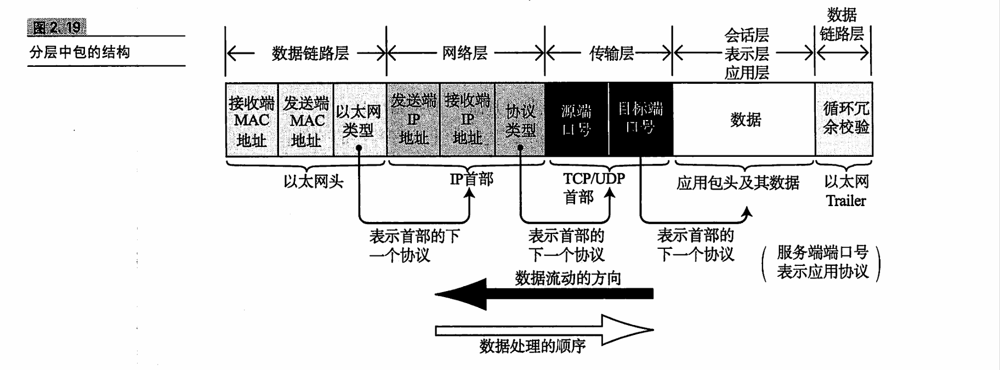

Author：蒋磊
Time：2024-12-21 20：05
前提：需要知道Ebpf的相关知识

一：关于katran中的encap方面的解释，知识总结：
1.encap是什么？
encap是一种技术，它可以将一个网络包封装成另一种网络包，并在目标主机上执行。encap可以用于隐藏原始数据，保护隐私，或者实现某些功能。在katran中，使用encap来封装原始数据包。

2.源码解读：katran/decap/bpf/ 理清思绪
首先，读到的函数是：
int xdpdecap(struct xdp_md * ctx)这个函数，bpf程序将这个函数打在xdp hook上，也就是网卡层面，但=当收到数据包时，（注意，数据包被cap封装了），会进入到这个函数处理之中，
函数主体如下：
SEC(DECAP_PROG_SEC)
int xdpdecap(struct xdp_md* ctx) {
  void* data = (void*)(long)ctx->data;
  void* data_end = (void*)(long)ctx->data_end;
  struct ethhdr* eth = data;
  __u32 eth_proto;
  __u32 nh_off;
  nh_off = sizeof(struct ethhdr);

  if (data + nh_off > data_end) {
    // bogus packet, len less than minimum ethernet frame size
    return XDP_DROP;
  }

  eth_proto = eth->h_proto;

  if (eth_proto == BE_ETH_P_IP) {
    return process_packet(data, nh_off, data_end, false, ctx);
  } else if (eth_proto == BE_ETH_P_IPV6) {
    return process_packet(data, nh_off, data_end, true, ctx);
  } else {
    // pass to tcp/ip stack
    return XDP_PASS;
  }
}

h15，h16：获取到数据包的头部和尾部，首先，会进行判断，如果数据包不合格，就会被丢弃。然后，我们进行数据包类型的判断，如果是IP包，就会调用process_packet函数，如果是IPv6包，就会调用process_packet函数。
这里我们用一张图片来讲述数据包中类型的关系：
，这张图片讲述了每个头部中都会有下一个头部所对应的协议类型的定义
process_packet函数的主体如下：
__always_inline static int process_packet(void *data,
                                         __u64 off, 
                                         void *data_end, 
                                         bool is_ipv6, 
                                         struct xdp_md *ctx) {
    struct packet_description packet = {};
    struct decap_stats *data_stats;
    __u32 key = 0;
    __u8 protocol;

    int ret;
    __u16 packet_size = 0;
    ret = process_l3_header(&packet, 
                            &protocol, 
                            &packet_size, 
                            data, 
                            off, 
                            data_end, 
                            is_ipv6); //l3层处理函数（IP层）
    if (ret >= 0) {
        return ret;
    }
    protocol = packet.flow.proto;

    data_stats = bpf_map_lookup_elem(&decap_cunters, &key);
    if (!data_stats) {
        return XDP_PASS;
    }
    //如果是隧道数据包，或者是ipv协议的以太帧
    if (protocol == IPPROTO_IPIP || protocol == IPPROTO_IPV6) {
#ifdef DECAP_STRICT_DESTINATION //decap_strict_destination
        ret = check_decap_dst(&packet, is_ipv6);
        if(ret >= 0) {
            return ret;
        }
#endif
        if (is_ipv6) {
            data_stats->decap_v6 += 1;
        } else {
            data_stats->decap_v4 += 1;
        }
        data_stats->total += 1;

        ret = process_encap_ipip_packet(&data, &data_end, ctx, &is_ipv6, &packet, &protocol, &packet_size, off);
        if (ret >= 0) {
            return ret;
        }
    }
#ifdef INLINE_DECAP_GUE
    else if (protocol == IPPROTO_UDP) {
        if (!parse_udp(data, data_end, is_ipv6, &packet)) {
            return XDP_PASS;
        }
        if(packet.flow.port16[1] == bpf_htons(GUE_DPORT)) {
#ifdef DECAP_STRICT_DESTINATION
            ret = check_decap_dst(&packet, is_ipv6);
            if(ret >= 0) {
                return ret;
            }
#endif

            if(is_ipv6) {
                data_stats->decap_v6 += 1;
            } else {
                data_stats->decap_v4 += 1;
            }
            data_stats->total += 1;
            bool inner_ipv6 = false;
            ret = process_encaped_gue_packet(&data, &data_end, ctx, is_ipv6, &inner_ipv6);
            if (ret >= 0) {
                return ret;
            }
            validate_tpr_server_id(data, off, data_end, inner_ipv6, ctx, data_stats);

        }
    }
#endif
}
整个bpf程序的核心，就在这个函数之中，一步步分析：
这个函数首先会进入到l3层处理函数process_l3_header中，其中l3层是ip层，具体函数如下：
__always_inline static int process_l3_header(struct packet_description *packet,
                                            __u8 *protocol,
                                            __u16 *packet_size,
                                            void *data,
                                            __u64 off,
                                            void *data_end,
                                            bool is_ipv6
                                            ) {

    struct iphdr *iph;
    struct ipv6hdr *ipv6h;
    __u64 iph_len;
    if (is_ipv6) {
        //ipv6
        ......
        if(*protocol == IPPROTO_FRAGMENT) {
            return XDP_DROP;
        }
#ifdef DECAP_STRICT_DESTINATION
        memcpy(packet->flow.dstv6, ipv6h->daddr.s6_addr32, 16);
#endif //decap_strict_destination
    } else {
        ........
        if (iph->frag_off & PACKET_FRAGMENTED) {
            return XDP_DROP;
        }
#ifdef DECAP_STRICT_DESTINATION
        packet->flow.dst = iph->daddr;
#endif
    }
    return FURTHER_PROCESSING;
}
h123:参数的定义，第一个参数是我们创建的数据包描述结构体，第二个参数为协议类型，第三个参数为数据包的大小，第四个参数为数据包的起点，第五个参数为为前一个函数（process_packet）传过来的的以太网帧的头部长度，第六个参数为数据包的尾部，第七个参数定义是否为ipv6数据包。
首先，如果是ipv6的数据包，检查是否合法，然后，将数据包结构体所需数据复制，其中nexthdr是下一个头部的协议类型，注意IPPROTO_FRAGMENT说明，这个数据包具有分片拓展的类型，我们不对此进行处理
如果是ipv4的数据包，同理，进行数据复制到我们的结构体之中
再回到process_packet函数之中，有了l3层的处理后，我们继续往下，将我们在结构体中的协议类型，复制到协议变量之中，在我们的bpf的map中寻求数据包类型的存储变量，如果存储变量不存在，我们让数据包进入tcp/ip协议栈处理。
接下来，根据协议，如果协议ipip或者是ipv6，如果我们定义了DECAP_SIRICT_DESTINATION的宏，我们会进入check_decap_dst函数之中，这个函数的大概主体如下：
#ifdef DECAP_STRICT_DESTINATION
__always_inline static int check_decap_dst(struct packet_description *packet, 
                                          bool is_ipv6) {
    struct real_definition * host_primary_addrs;
    __u32 addr_index;

    if (is_ipv6) {
        addr_index = V6_SRC_INDEX;
        host_primary_addrs = bpf_map_lookup_elem(&packet_srcs, &addr_index);
        if (host_primary_addrs) {
            if (host_primary_addrs->dstv6[0] != packet->flow.dstv6[0] ||
               host_primary_addrs->dstv6[1] != packet->flow.dstv6[1] ||
               host_primary_addrs->dstv6[2] != packet->flow.dstv6[2] ||
               host_primary_addrs->dstv6[3] != packet->flow.dstv6[3]) {
                    return XDP_PASS;
               }
        }
    } else {
        addr_index = V4_SRC_INDEX;
        host_primary_addrs = bpf_map_lookup_elem(&packet_srcs, &addr_index);
        if (host_primary_addrs) {
            if (host_primary_addrs->dst != packet->flow.dst) {
                return XDP_PASS;
            }
        }
    }
    return FURTHER_PROCESSING;
}
#endif //decap_strict_destination
这个函数首先定义了一个结构体，这个结构体存储着数据包应该被发送的目的地址，我们在bpf程序中，定义了一个array类型的map，这个map有着两个元素，分别为ipv4和ipv6，分别对应两个结构体，这两个结构体中存储着目的地址，我们在map中寻找对应的目的地址，将数据包中的目的地址与存储的目的地址相比较，如果不一样，我们丢弃数据包，反之，继续前面的处理（这个目的地址的结构体的内容可以由我们自行定义，或者配置文件定义--一般是）

再回到前面的函数之中，如果是ipv4，data_stats中对应的变量加一，ipv6如此。data_stats中total加一，之后，我们会进入到process_encap_ipip_packet函数之中，这个函数的主体如下：
__always_inline static int process_encap_ipip_packet(void **data, 
                                                     void **data_end, 
                                                     struct xdp_md *xdp,
                                                     bool *is_ipv6,
                                                     struct packet_description *packet,
                                                     __u8 *protocol,
                                                     __u64 *packet_size,
                                                     __u64 off) {
    if (*protocol == IPPROTO_IPIP) {
        //ipip隧道设备
        if (*is_ipv6) {
            //ipv6
            if ((*data + sizeof(struct ethhdr) + sizeof(struct ipv6hdr)) > *data_end) {
                return XDP_DROP;
            }
            if (!decap_ipv6(xdp, data, data_end, true)) {
                return XDP_DROP;
            }
        } else {
            if ((*data + sizeof(struct ethhdr) + sizeof(struct iphdr)) > *data_end) {
                return XDP_DROP;
            }
            if (!decap_v4(xdp, data, data_end)) {
                return XDP_DROP;
            }
        }
    } else if (*protocol == IPPROTO_IPV6) {
        //ipv6
        if ((*data + sizeof(struct ethhdr) + sizeof(struct ipv6hdr)) > *data_end) {
            return XDP_DROP;
        }
        //不是隧道相关，直接解封装
        if (!decap_v6(xdp, data, data_end, false)) {
            return XDP_DROP;
        }
    }
    return FURTHER_PROCESSING;
}
这个函数传入必要的参数，如果是ipip的情况下，这里讲一下ipip的相关知识：
ipip隧道设备，是一种网络设备，它可以将一个ipv4的数据包封装成一个ipv4的数据包，并在目标主机上执行。ipip隧道设备的作用是隐藏原始数据，保护隐私，或者实现某些功能。
他的头部结构如图：
[text](<../czkatran/tcp/udp/ip/Linux 虚拟网卡：隧道 ·风与云原生.pdf>)
如图，非常清晰的了解头部信息
接着，如果是ipv6的情况下，我们会进入到decap_v6函数之中，这个函数主体如下：
__always_inline static bool decap_v6(struct xdp_md *xdp,
                                    void **data,
                                    void **data_end,
                                    bool *isnner_ipv4) {
    struct ethhdr *eth_new;
    struct ethhdr *eth_old;
    eth_old = (struct ethhdr *) *data;
    eth_new = (struct ethhdr *)*data + sizeof(struct ipv6hdr);
    memcpy(eth_new->h_source, eth_old->h_source, sizeof(eth_new->h_source));
    memcpy(eth_new->h_dest, eth_old->h_dest, sizeof(eth_new->h_dest));
    if(isnner_ipv4) {
        eth_new->h_proto = BE_ETH_P_IP;
    } else {
        eth_new->h_proto = BE_ETH_P_IPV6;
    }

    if(XDP_ADJUST_HEAD_FUNC(xdp, (int)(sizeof(struct ipv6hdr)))) {
        return false; 
    }
    *data = (void *)(long)xdp->data;
    *data_end = (void *)(long)xdp->data_end;
    return true;
}
在这个函数下，函数传入指向指针的指针，一边修改指针的位置，如代码所示，我们其实需要的是inner的头部，函数中，定义两个指针，一个指向outter头部，一个指向inner头部，然后，将需要的信息复制，改变协议类型，最后，调用libbpf中的bpf_xdp_adjust_head，将xdp指针向后移动一个头部的大小，并返回true，表示成功。ipv4也是如此。

回到process_encap_ipip_packet函数之中，在IPPROTO_IPIP和IPPROTO_IPV6两种情况下，进行了相关处理，最后返回继续处理的标志。

回到核心函数中，在此，我们分析完了一般情况，接下来，分析一些特殊情况。
在定义了INLINE_DECAP_GUE的宏的情况下，我们会判断数据包是否为udp类型，如果是，我们进入到parse_udp函数之中，这个函数主体如下：
__always_inline static bool parse_udp(void *data,
                                      void *data_end,
                                      bool is_ipv6,
                                      struct packet_description *packet) {
    bool is_icmp = !((packet->flags & F_ICMP) == 0); //是否是icmp报文
    __u64 off = calc_offset(is_ipv6, is_icmp); 
    struct udphdr* udp;
    udp = (struct udphdr*)data + off;
    if(udp + 1 > data_end) {
        return false;
    }
    //source dest port 转换                                 
    if(!is_icmp) {
        packet->flow.port16[0] = udp->source;
        packet->flow.port16[1] = udp->dest;
    } else {
        packet->flow.port16[0] = udp->dest;
        packet->flow.port16[1] = udp->source;
    }
    return true;
}
首先，在udphdr下，查找是否有着icmp标志，带着标志，进入计算offset的函数之中，这个函数如下：
__always_inline static __u64 calc_offset(bool is_ipv6,
                                        bool is_icmp) {
    __u64 off = sizeof(struct ethhdr);
    if(is_ipv6) {
        off += sizeof(struct ipv6hdr);
        if(is_icmp) {
            off += (sizeof(struct icmp6hdr) + sizeof(struct ipv6hdr));
        }
    } else {
        off += sizeof(struct iphdr);
        if(is_icmp) {
            off += (sizeof(struct icmphdr) + sizeof(struct iphdr));
        }
    }
    return off;
}
首先，----------------------------------------------------------

回到process_packet函数之中，在解析udp情况之后，处理了port和DECAP_STRICT_DESTINATION宏的情况，接下来，将data_stats中的数据更新，然后进入到process_encaped_gue_packet函数之中，这个函数主体如下：
#ifdef INLINE_DECAP_GUE
__always_inline static int process_encaped_gue_packet(void ** data,
                                                      void ** data_end,
                                                      struct xdp_md *xdp,
                                                      bool is_ipv6,
                                                      bool *inner_ipv6) {
    int offset = 0;
    if(is_ipv6) {
        __u8 v6 = 0;
        .............
        //指向GUE header
        v6 = ((__u8*)(*data))[offset];
        v6 &= GUEV1_IPV6MASK;
        *inner_ipv6 = v6 ? true : false;
        if(v6) {
            //inner packet是ipv6类型的数据包
            if(!gue_decap_v6(xdp, data, data_end, false)) {
                return XDP_DROP;
            }
        } else {
            //inner packet是ipv4类型的数据包
            if(!gue_decap_v6(xdp, data, data_end, true)) {
                return XDP_DROP;
            }
        }
    } else {
        .........
        if(!gue_decap_v4(xdp, data, data_end)) {
            return XDP_DROP;
        }
    }
    return FURTHER_PROCESSING;
}
#endif //INLINE_DECAP_GUE
首先，根据是否是ipv6进入到不同路径中，主要分析的是GUE的隧道类型，如果是ipv6
调用gue_decap_v6函数，这个函数的主体如下：
__always_inline static bool gue_decap_v6(struct xdp_md *xdp, void **data, void **data_end bool inner_v4) {
    struct ethhdr *eth_new;
    struct ethhdr *eth_old;
    eth_old = (struct ethhdr *)(*data);
    eth_new = (struct ethhdr *)(*data + sizeof(struct ipv6hdr) + sizeof(udphdr));
    //RECORD_GUE_ROUTE(eth_old, eth_new, *data_end, true, false);//?
    memcpy(eth_new->h_source, eth_old->h_source, sizeof(eth_new->h_source));
    memcpy(eth_new->h_dest, eth_old->h_dest, sizeof(eth_new->h_dest));
    eth_new->proto = inner_v4 ? BE_ETH_P_IP : BE_ETH_P_IPV6;
    if(XDP_ADJUST_HEAD_FUNC(xdp, sizeof(struct ipv6hdr) + sizeof(udphdr))) {
        return false;
    }
    *data = (void *)(long)xdp->data;
    *data_end = (void *)(long)xdp->data_end;
    return true;
}
#endif //INLINE_DECAP_GUE
这个函数类似于decap_v6这个函数，大致内容不必多说。
接着process_encaped_gue_packet函数，如果是ipv4，则进入相对应的函数之中，
返回到核心函数，最后，核心函数会在validate_tpr_server_id函数之中，完成对server_id的采集，这个函数主体如下：
__always_inline static void validate_tpr_server_id(void *data,
                                                   __u64 off, 
                                                   void *data_end, 
                                                   bool is_ipv6, 
                                                   struct xdp_md *xdp, 
                                                   struct decap_stats *data_stats) {
    __u16 inner_packet_size= 0;
    struct packet_description inner_packet = {}; //内嵌的数据包描述符
    __u8 inner_protocol = 0;
    if(process_l3_header(&inner_packet, &inner_protocol, &inner_packet_size, data, off, data_end, is_ipv6) >= 0) {
        return;
    }

    if(inner_protocol != IPPROTO_TCP) {
        return;
    }
    if(!parse_tcp(data, data_end, is_ipv6, &inner_packet)) {
        return;
    }

    if(!(inner_packet.flags & F_SYN_SET)) {
        __u32 s_key = 0;
        __u32 *server_id_host = bpf_map_lookup_elem(&tpr_server_id, &s_key);
        if(server_id_host && *server_id_host > 0) {
            __u32 server_id = 0;
            tcp_hdr_opt_lookup_server_id(xdp, is_ipv6, &server_id);
            if(server_id > 0) {
                data_stats->tpr_total += 1;
                if(server_id != *server_id_host) {
                    data_stats->tpr_misrouted += 1;
                }
            }
        }
    }
}
这个函数主要分析内嵌的数据包的头部信息，首先分析L3层的头部信息，调用了process_l3_header函数处理，接着，排除不是Tcp协议的情况，接着调用parse_tcp函数，这个函数主体如下：
__always_inline static bool parse_tcp(void *data,
                                      void *data_end,
                                      bool is_ipv6,
                                      struct packet_description *packet) {

    bool is_icmp = !((packet->flags & F_ICMP) == 0); //是否是icmp报文
    __u64 off = calc_offset(is_ipv6, is_icmp);
    struct tcphdr *tcp;
    tcp = (struct tcphdr *)(data + off);
    if(tcp + 1 > data_end) {
        return false;
    }

    if(tcp->syn) {
        packet->flags |= F_SYN_SET;
    }
    if(!is_icmp) {
        packet->flow.port16[0] = tcp->source;
        packet->flow.port16[1] = tcp->dest;
    } else {
        packet->flow.port16[0] = tcp->dest;
        packet->flow.port16[1] = tcp->source;
    }

    return true;
}
这个函数主要处理了icmp报文的情况，然后返回，
接着，判断标志位中是否存在F_SYN_SET，如果存在，则调用tcp_hdr_opt_lookup_server_id函数，获取server_id，这个函数主体如下：
__always_inline static int tcp_hdr_opt_lookup_server_id(const struct xdp_md *xdp,
                                                        bool is_ipv6,
                                                        __u32 *server_id) {

    const void *data = (void *)(long)(xdp->data);
    const void *data_end = (void *)(long)(xdp->data_end);
    struct tcphdr *tcphdr;
    __u64 hdr_offset = 0;
    __u8 tcp_hdr_opt_len = 0;
    struct hdr_opt_state tcp_opt = {};
    int err = 0;

    hdr_offset = calc_offset(is_ipv6, false);
    tcphdr = (struct tcphdr *)(data + hdr_offset);
    //判断
    if(tcphdr + 1 > data_end) {
        return FURTHER_PROCESSING;
    }

    //doff 四位 单位为 4字节（32位）
    //doff * 4 再减去头部长度，如果为零，表示没有tcp选项
    tcp_hdr_opt_len = (tcphdr->doff * 4) - sizeof(struct tcphdr);
    if (tcp_hdr_opt_len < TCP_HDR_OPT_LEN_TPR) {
        return FURTHER_PROCESSING;
    }
    tcp_opt.hdr_bytes_remaining = tcp_hdr_opt_len;
    tcp_opt.bytes_offset = hdr_offset + sizeof(struct tcphdr); //指向选项的第一个字节

#if LINUX_VERSION_CODE < KERNEL_VERSION(5, 3, 0) || \
    !defined TCP_HDR_OPT_SKIP_UNROLL_LOOP
    //在提供的代码中，这段指令出现在两个函数中：tcp_hdr_opt_lookup和tcp_hdr_opt_lookup_skb。这两个函数的主要功能是从TCP数据包的选项字段中解析出服务器ID。由于BPF（Berkeley Packet Filter）程序的限制，特别是在Linux内核版本低于5.3的系统中，BPF验证器（verifier）无法验证循环的边界条件。因此，为了通过验证器的检查，编译器需要对循环进行完全展开，确保循环体中的每一部分都被正确地验证。
#pragma clang loop unroll(full)
#endif
    //循环解析TCP选项
    for (int i = 0; i < TCP_HDR_OPT_MAX_OPT_CHECKS; i++) {
        err = parse_hdr_opt(xdp, &tcp_opt);
        if (err || !tcp_opt.hdr_bytes_remaining) {
            break;
        }
    }
    if(!tcp_opt.server_id) {
        return FURTHER_PROCESSING;
    }
    *server_id = tcp_opt.server_id;
    return 0;
}
#endif //TCP_SERVER_ID_ROUTING || DECAP_TPR_STATS
函数首先计算位移，排除错误的数据包，在我们的设计下，server_id通常会被保存在Tcp的选项字段中，
我们通过计算，得到option段的长度与位移，我们用一个结构体hdr_opt_state去保存长度与位移，为后面的分析做准备，在BPF程序中，需要注意kernel的版本大小，在需要的时候进行编译循环完全展开，原由较低的内核版本中，BPF程序循环判断无法通过验证器的检查。在循环中，我们调用parse_hdr_opt来解析Tcp的选项字段，以下是他的调用链：
tcp_hdr_opt_lookup_server_id--->parse_hdr_opt--->parse_hdr_opt_raw
根据调用链所展示，实际上调用的是parse_hdr_opt_raw函数
函数主题如下：
__always_inline int parse_hdr_opt_raw(const void *data,
                                      const void *data_end, 
                                      struct hdr_opt_state *tcp_state) {

    __u8 *tcp_opt, kind, hdr_len;

    if(!tcp_state) {
        return -1;
    }

    tcp_opt = (__u8 *)(data + tcp_state->bytes_offset);
    if(tcp_opt + 1 > data_end) {
        return -1;
    }

    kind = tcp_opt[0];
    if(kind == TCP_OPT_EOF) {
        return -1;
    }

    if(kind == TCP_OPT_NOP) {
        tcp_state->bytes_offset++;
        tcp_state->hdr_bytes_remaining--;
        return 0;
    }

    if(tcp_state->hdr_bytes_remaining < 2 || 
     tcp_opt + sizeof(__u8) + sizeof(__u8) > data_end) {
        // 选项长度至少为2字节 或者指针右移两位指向的value（server_id）超过了报文的末尾
        return -1;
    }

    hdr_len = tcp_opt[1];
    if(hdr_len > tcp_state->hdr_bytes_remaining) {
        return -1;
    }

    if(kind == TCP_HDR_OPT_MAX_OPT_CHECKS) {
        //再次检查
        if(hdr_len != TCP_HDR_OPT_LEN_TPR) {
            return -1;
        }
        if(tcp_opt + TCP_HDR_OPT_LEN_TPR > data_end) {
            return -1;
        }

        tcp_state->server_id = *(__u32 *)&tcp_opt[2];
        return 1;
    }
    
    tcp_state->bytes_offset += hdr_len;
    tcp_state->hdr_bytes_remaining -= hdr_len;
    return 0;
}
这个函数主要是做了选择字段的检查，重点在于，如果遇到TCP_HDR_OPT_MAX_OPT_CHECKS这个标志，说明，在选项字段中包含了server_id，我们将server_id存储起来，返回1，跳出bpf程序中的循环，否则，更新长度与位移，继续检查，知道遇到TCP_OPT_EOF或者hdr_bytes_remaining为0为止。
